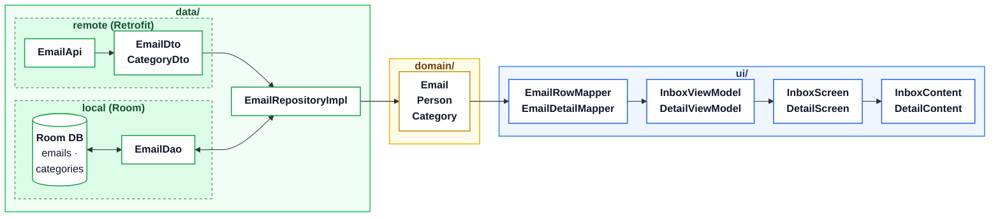

```mermaid
%%{init: {
  'flowchart': {
    'curve': 'monotoneX',
    'nodeSpacing': 20,
    'rankSpacing': 30,
    'padding': 10
  }
}}%%
flowchart LR
    subgraph Data["<b>data/</b>"]
        subgraph Remote["<b>remote (Retrofit)</b>"]
            API["<b>EmailApi</b>"]:::dataNode
            DTO["<b>EmailDto</b><br/><b>CategoryDto</b>"]:::dataNode
            API --> DTO
        end

        subgraph Local["<b>local (Room)</b>"]
            DB[("<b>Room DB</b><br/>emails ·<br/>categories")]:::dataNode
            DAO["<b>EmailDao</b>"]:::dataNode
            DB <--> DAO
        end

        Repo["<b>EmailRepositoryImpl</b>"]:::dataNode

        DTO --> Repo
        DAO <--> Repo
    end

    subgraph Domain["<b>domain/</b>"]
        Model["<b>Email</b><br/><b>Person</b><br/><b>Category</b>"]:::domainNode
    end

    subgraph UI["<b>ui/</b>"]
        Mapper["<b>EmailRowMapper</b><br/><b>EmailDetailMapper</b>"]:::uiNode
        VM["<b>InboxViewModel</b><br/><b>DetailViewModel</b>"]:::uiNode
        Screen["<b>InboxScreen</b><br/><b>DetailScreen</b>"]:::uiNode
        Content["<b>InboxContent</b><br/><b>DetailContent</b>"]:::uiNode

        Mapper --> VM
        VM --> Screen
        Screen --> Content
    end

    %% Cross-layer flow: repository publishes domain models, the UI mappers consume them
    Repo --> Model
    Model --> Mapper

    %% Node Styles (GitHub Light & Dark mode safe)
    classDef dataNode fill:#ffffff,stroke:#16a34a,stroke-width:1.5px,color:#0f172a
    classDef domainNode fill:#ffffff,stroke:#ca8a04,stroke-width:1.5px,color:#0f172a
    classDef uiNode fill:#ffffff,stroke:#2563eb,stroke-width:1.5px,color:#0f172a

    %% Subgraph Styles
    style Data fill:#f0fdf4,stroke:#22c55e,stroke-width:1.5px,color:#14532d
    style Local fill:#dcfce7,stroke:#15803d,stroke-width:1px,stroke-dasharray: 4 4,color:#14532d
    style Remote fill:#dcfce7,stroke:#15803d,stroke-width:1px,stroke-dasharray: 4 4,color:#14532d
    style Domain fill:#fefce8,stroke:#eab308,stroke-width:1.5px,color:#713f12
    style UI fill:#eff6ff,stroke:#3b82f6,stroke-width:1.5px,color:#1e3a8a
```
