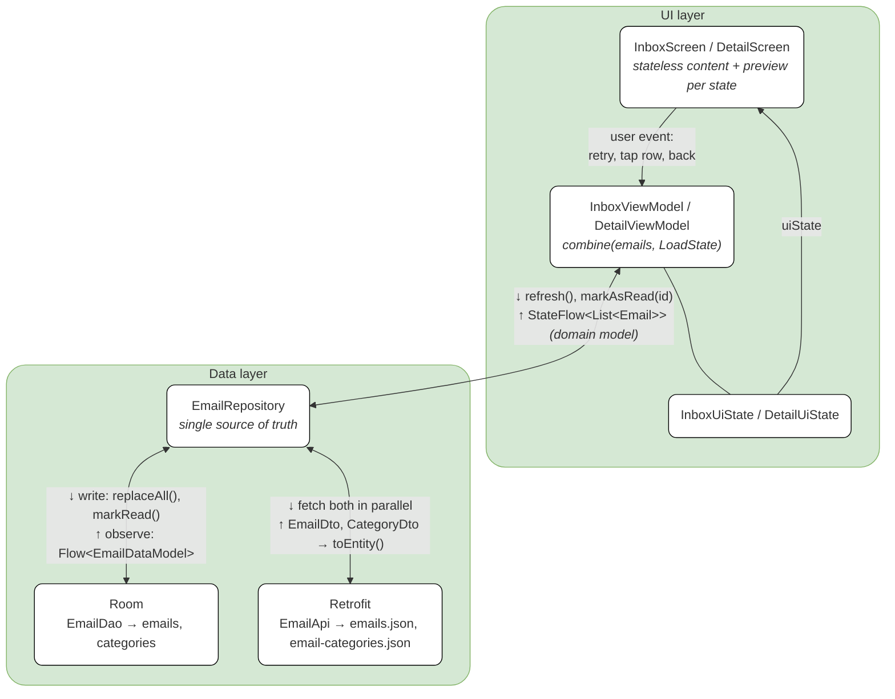

```mermaid
flowchart TB
    subgraph UI["UI layer"]
        direction TB
        Screen("InboxScreen / DetailScreen<br/><i>stateless content + preview per state</i>")
        VM("InboxViewModel / DetailViewModel<br/><i>combine(emails, LoadState)</i>")
        UiState("InboxUiState / DetailUiState")
        Screen -- "user event:<br/>retry, tap row, back" --> VM
        VM --- UiState
        UiState -- "uiState" --> Screen
    end

    subgraph DATA["Data layer"]
        direction TB
        Repo("EmailRepository<br/><i>single source of truth</i>")
        DB("Room<br/>EmailDao → emails, categories")
        API("Retrofit<br/>EmailApi → emails.json, email-categories.json")
        Repo <-- "↓ write: replaceAll(), markRead()<br/>↑ observe: Flow&lt;EmailDataModel&gt;" --> DB
        Repo <-- "↓ fetch both in parallel<br/>↑ EmailDto, CategoryDto → toEntity()" --> API
    end

    %% One two-way edge (not two opposite edges) so the layout keeps the UI layer on top.
    VM <-- "↓ refresh(), markAsRead(id)<br/>↑ StateFlow&lt;List&lt;Email&gt;&gt; <i>(domain model)</i>" --> Repo

    style UI fill:#d5e8d4,stroke:#82b366,stroke-width:1px,rx:24,ry:24
    style DATA fill:#d5e8d4,stroke:#82b366,stroke-width:1px,rx:24,ry:24
    classDef box fill:#ffffff,stroke:#000000,stroke-width:1px,rx:10,ry:10
    class Screen,VM,UiState,Repo,DB,API box
```
